# Отчёт о проделанной работе


## Part 1. Установка ОС

- скриншот вывода ```cat /etc/issue```

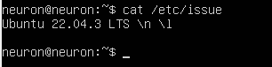


## Part 2. Создание пользователя

- скриншот вызова команды для создания пользователя. Для этого используем команду ```sudo adduser <new_user>```.
 После этого добавляем его в группу adm (нахождение в этой группе позволяет читать логи из директории ```/var/log```):
 ```
 sudo usermod -G -a <group> <user>
 ```


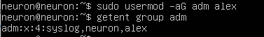

P.S.
Полезные флаги для usergmod:

- ```-G``` - дополнительные группы, в которые нужно добавить пользователя
- ```-g``` изменить основную группу для пользователя
- ```-R``` удалить пользователя из группы.
-----

- скриншот вывода ```cat /etc/passwd```

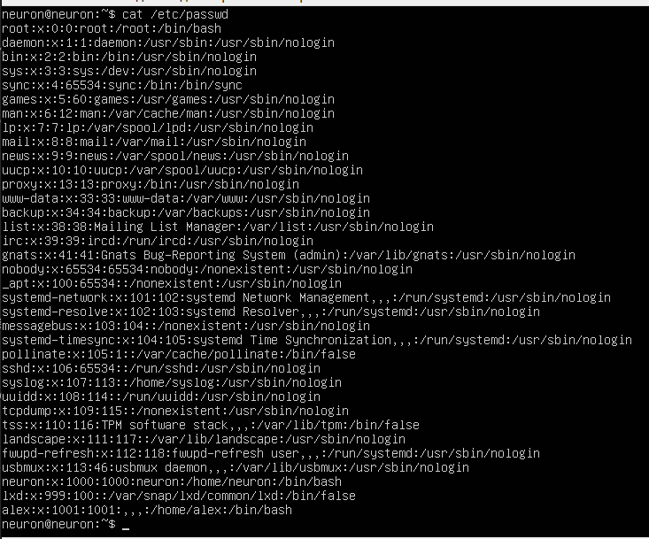


## Part 3. Настройка сети ОС

- задаём название машины вида user-1. Для этого используем команду:
 ```sudo hostnamectl set-hostname <new host_name>```

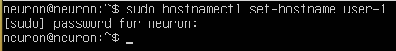

После перезагрузки изменения вступили в силу.

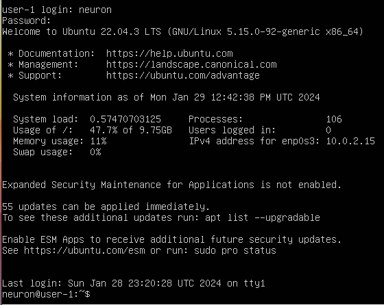

- в ```systemd``` есть своя утилита для настройки даты и часового пояса - ```timedatectl```. 
Узнать текущий часовой пояс машины можно, выполнив команду ```timedatectl status```:

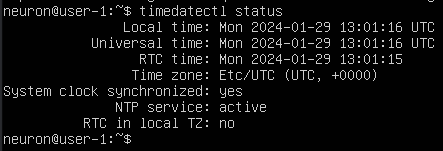

- для просмотра всех имеющихся часовых зон мы можем выполнить команду ```timedatectl list-timezones```:

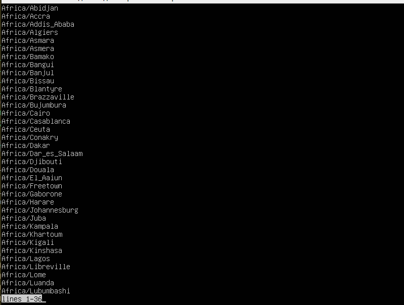


- для изменения текущей часовой зоны выполним команду вида ```sudo timedatectl set-timezone <zone>```. После выполнения вновь выведем текущую часовую зону и увидим, что она действительно изменилась:

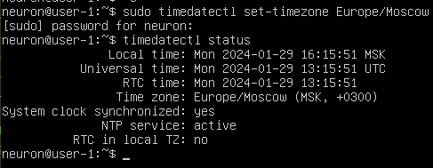

----

### Справка о сетевых интерфейсах

**Сетевой интерфейс** - это точка взаимодействия между компьютером и сетью. Он представляет собой аппаратное или программное обеспечение, которое позволяет компьютеру подключаться к сети и обмениваться данными с другими устройствами.

Если говорить простыми словами, то сетевой интерфейс - это как дверь, через которую компьютер "выходит" в интернет или другую сеть. Без этой "двери" компьютер не сможет общаться с другими устройствами.

Сетевой интерфейс может быть физическим, например, сетевая карта в компьютере или Wi-Fi адаптер. Он также может быть программным, например, виртуальная сетевая карта в виртуальной машине или программное обеспечение, которое позволяет компьютеру подключаться к сети.


----


- чтобы вывести названия всех сетевых интерфейсов, используем встроенную утилиту ```ip```. Для компактного вывода информации о списке всех сетевых интерфейсов используем команду ```ip -br link show```:

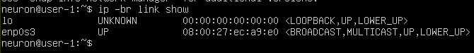

Мы видим, что один из сетевых интерфейсов - lo. Что это?


----
### Справка о lo

**Интерфейс lo (loopback)** - это виртуальный сетевой интерфейс, который присутствует на большинстве операционных систем. Он используется для тестирования сетевых приложений и сервисов, а также для обеспечения доступа к локальной машине из сети.

Если говорить простыми словами, то интерфейс lo - это как зеркало, которое позволяет компьютеру "увидеть" самого себя. Он позволяет отправлять и получать пакеты данных, которые не покидают компьютер.

Например, если вы хотите проверить, работает ли ваш веб-сервер, вы можете отправить запрос на адрес 127.0.0.1 (это стандартный IP-адрес для интерфейса lo), и ваш компьютер ответит на этот запрос.

Также интерфейс lo используется для обеспечения доступа к локальной машине из сети. Например, если вы хотите получить доступ к файлам на вашем компьютере из интернета, вы можете настроить перенаправление портов на интерфейс lo.


----

### Справка о DHCP
**DHCP (Dynamic Host Configuration Protocol)** - это протокол, который позволяет автоматически назначать IP-адреса устройствам в сети. 

Если говорить простыми словами, то DHCP - это как почтальон, который разносит письма (IP-адреса) по домам (компьютерам). 

Когда компьютер подключается к сети, он отправляет запрос на DHCP-сервер, который назначает ему IP-адрес. Этот адрес может быть временным или постоянным, в зависимости от настроек сервера. 

DHCP-сервер также может назначать другие параметры, такие как маска подсети, адрес шлюза и DNS-серверы. Это позволяет компьютерам в сети общаться друг с другом и получать доступ к интернету.

Таким образом, DHCP упрощает процесс настройки сети, так как не нужно вручную назначать IP-адреса каждому устройству.

----


- чтобы узнать ip-адрес устройства, полученный от DHCP-сервера, выполним команду ```cat /var/log/syslog | grep -i 'dhcp'```:


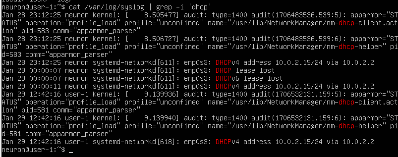


Мы видим, что нашему устройству был присвоен адрес ```10.0.2.15/24```.

Также его можно узнать и чуть проще, выполнив команду ```ip addr show```:

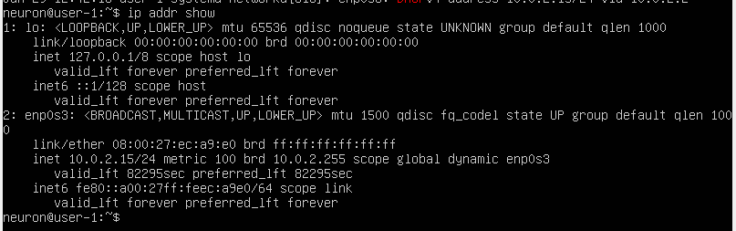


- Для того чтобы узнать внешний IP адрес cвоего устройства, можно открыть специальный сайт, который посмотрит, с какого IP Вы его открыли, и скажет его Вам. Один из таких сайтов - ifconfig.me. Обратимся к нему с помощью ```curl ifconfig.co``` и получим желаемый внешний ip-адрес:


- чтобы узнать внутренний ip-адоес, выполним команду ```hostname -I```:


----

В чём разница между внутренним и внешним ip-адресами?

**Внешний IP-адрес** - это адрес, который присваивается вашему устройству или сети провайдером интернет-услуг. Он позволяет другим устройствам в интернете находить и общаться с вашим устройством.

**Внутренний IP-адрес** - это адрес, который присваивается вашему устройству или сети внутри вашей локальной сети. Он используется только для обмена данными между устройствами в вашей сети.

Если говорить простыми словами, то внешний IP-адрес - это как ваш домашний адрес, который знают все в городе, а внутренний IP-адрес - это как номер вашей квартиры, который знают только ваши соседи.

----


- Попробуем задать статичные настройки ip, gw (gateway), DNS.

Что такое gw в данном контексте?

----
### Справка о Gateway


**Gateway в рамках компьютерных сетей** - это аппаратное или программное обеспечение, которое позволяет сопрягать разные компьютерные сети, использующие разные протоколы. Он конвертирует протоколы одного типа физической среды в протоколы другой физической среды. Например, при подключении компьютера к интернету обычно используется сетевой шлюз. Маршрутизатор (роутер) является одним из примеров аппаратных сетевых шлюзов. Основная задача сетевого шлюза - конвертировать протокол между сетями. Шлюз по умолчанию - это сетевой шлюз, на который пакет отправляется в том случае, если маршрут к сети назначения пакета не известен. Он применяется в сетях с хорошо выраженными центральными маршрутизаторами, в малых сетях, в клиентских сегментах сетей.‍

----


- Протокол DHCP автоматически присваивает устройству IP. Чтобы этого не происходило, необходимо отключить облачную инициализацию. Открываем файл конфигурации ```subiquity-disable-cloudinit-networking.cfg``` в каталоге ```/etc/cloud/cloud.cfg.d/``` и проверим отсутствие конфигурации:

  ```sudo vim /etc/cloud/cloud.cfg.d/subiquity-disable-cloudinit-networking.cfg```


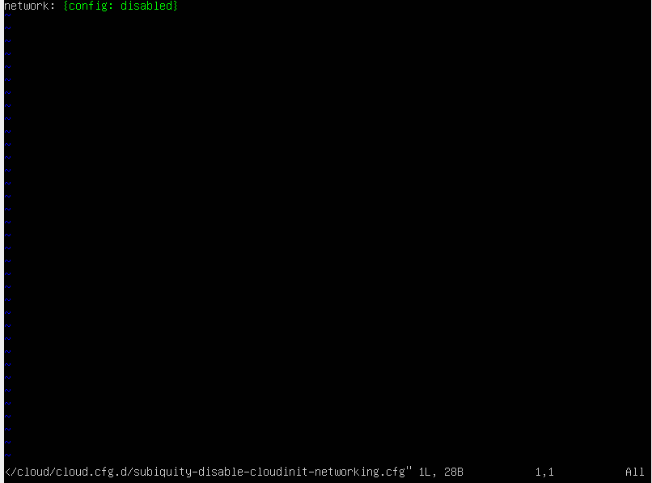


- Перейдём к конфигурации Netplan. **Netplan** - это относительно новая утилита для осуществления настройки сети в Ubuntu. Более подробно о ней можно прочитать [тут](https://habr.com/ru/articles/448400/ "статья на хабре"). В данном случае файл конфигурации - это ```oo-installer-config.yaml```. Откроем его в текстовом редакторе ```vim```:

```sudo vim /etc/netplan/00-installer-config.yaml```

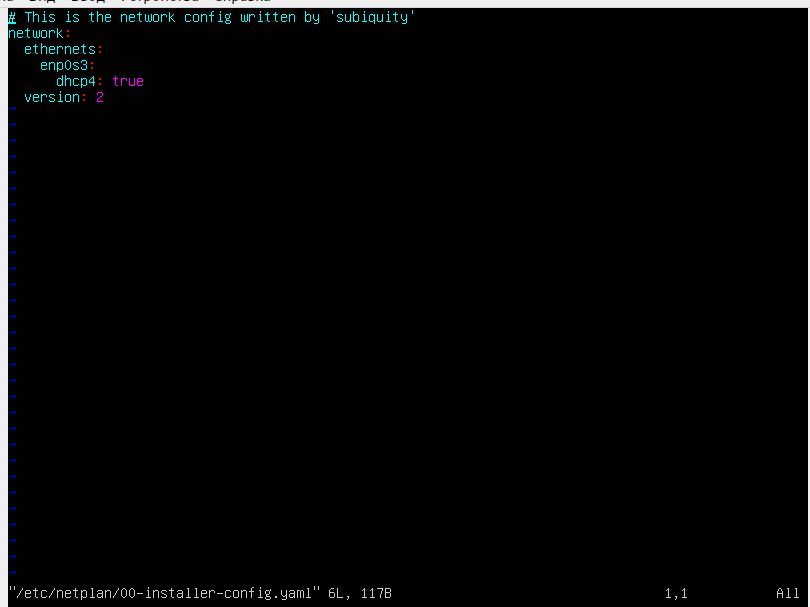

- Пропишем новые настройки для нашего конфигурационного файла *

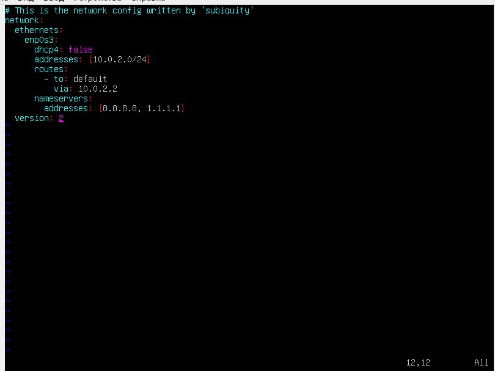


*, **где**:

- **version** — версия YAML. На момент обновления статьи, была 2.
- **ethernets** — настройка сетевых адаптеров ethernet.
- **ens3** — настройки для соответствующих сетевых адаптеров
- **dhcp4** — будет ли получать сетевой адаптер IP-адрес автоматически. Возможны варианты yes/true — получать адрес автоматически; no/false — адрес должен быть назначен вручную.
- **addresses** — задает IP-адреса через запятую.
- **routes** — настройка маршрутов. Для шлюза по умолчанию используем опцию и значение to: default. Ранее использовалась директива gateway4, но теперь она считается устаревшей (при применении настройки с ней система вернет предупреждение gateway4 has been deprecated, use default routes instead). Также обратите внимание на вариант с 0.0.0.0 — в более ранних версиях системы вариат с default выдаст ошибку, и нужно использовать конфигурацию с четыремя нулями.
- **nameservers** — настройка серверов имен (DNS).


- Затем сохраняем изменения с помощью команды ```netplan apply``` и перезагружаемся командой ```reboot```:


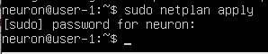


- Проверяем полученные изменения командой ```cat /etc/netplan/00-installer-config.yaml```:

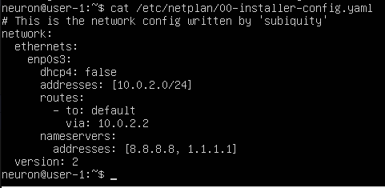


-Успешно пингуем удаленные хосты 1.1.1.1 и ya.ru командами ```ping 1.1.1.1``` и ```ping ya.ru```:

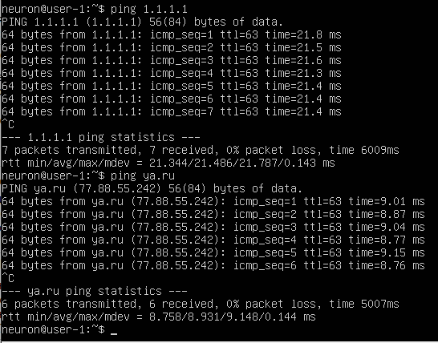


----

### Справка о ping


**ping** — утилита для проверки целостности и качества соединений в сетях. Утилита отправляет запросы указанному узлу сети и фиксирует поступающие ответы. Время между отправкой запроса и получением ответа позволяет определять двусторонние задержки по маршруту и частоту потери пакетов, то есть косвенно определять загруженность на каналах передачи данных и промежуточных устройствах.


----


## Part 4. Обновление ОС


- пакетный менеджер в дистрибутиве Ubuntu, как известно, - ```apt```. Для обновления всех пакетов, а также обновления информации из самого apt репозитория пропишем команду ```sudo apt update && sudo apt upgrade```:


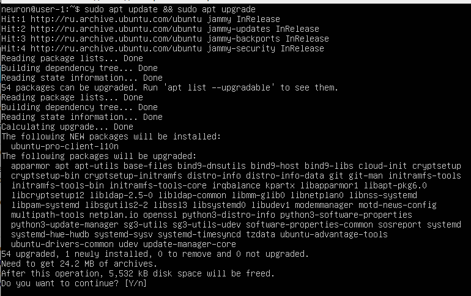

- после обновления продублируем команду выше и увидим отсутствие новых обновлений:

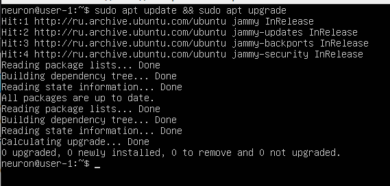


## Part 5. Использование sudo

----

### Справка о sudo


**Команда sudo** - substitute user and do, подменить пользователя и выполнить. Главное назначение sudo — это выполнить команду от имени другого пользователя, чаще всего от root. Смысл выполнения команды от root в том, что у него повышенные права доступа и, применяя sudo, обычный пользователь может выполнить те команды, на которые у него недостаточно прав доступа.

----

- проверим, что у пользователя ```alex```, созданного в Part 2, отсутствуют права sudo. Для этого напишем команду ```sudo -l -U alex```:


- затем наделим ```alex``` правами sudo и сменим пользователя на alex с помощью команд ```sudo usermod -aG sudo alex``` и ```su alex```:

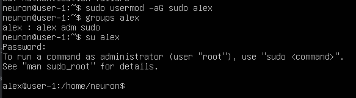


- выполним изменение hostname на любое (в данном случае ```user-2```), после чего пропишем ```reboot```:

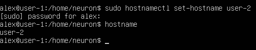


## Part 6. Установка и настройка службы времени

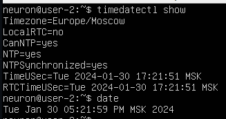


## Part 7. Установка и использование текстовых редакторов

- Для установки текстовых редакторов выполним команду ```sudo apt install vim && sudo apt install nano && sudo apt install mcedit```


### Для vim:

- ```vim test_vim.txt```. Чтобы внести изменения - ```I```, чтобы сохранить изменения - ```esc -> shift + : -> wq```. ```wq``` - write and quite.


- для выхода без изменений - ```esc -> shift + : -> q!```. Проверим, что изменения не сохранились:


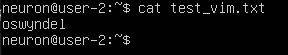

- Поиск: ```Esc + /<word_to_search>```; Замена: ```:%s/<change_this>/<to_this>```:

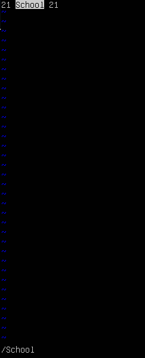
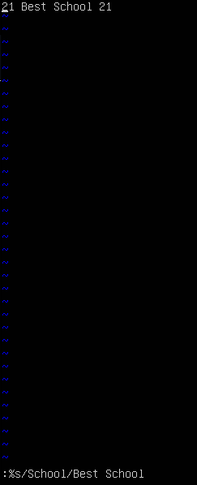


### Для nano:

- Для выхода с сохранением нужно выполнить ```Ctrl + O```, затем ```Ctrl + X```:

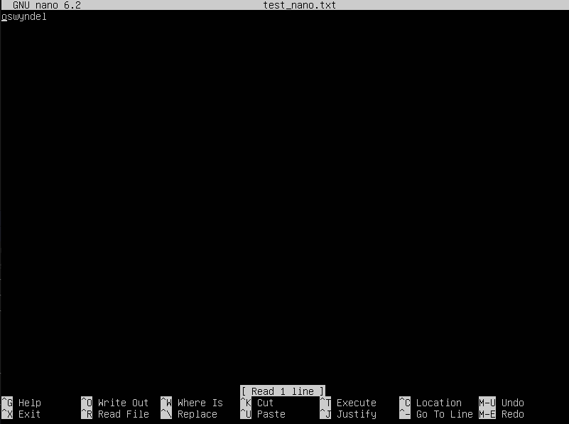

- Для выхода без сохранения нужно нажать ```Esc```, затем ```Ctrl + X```:

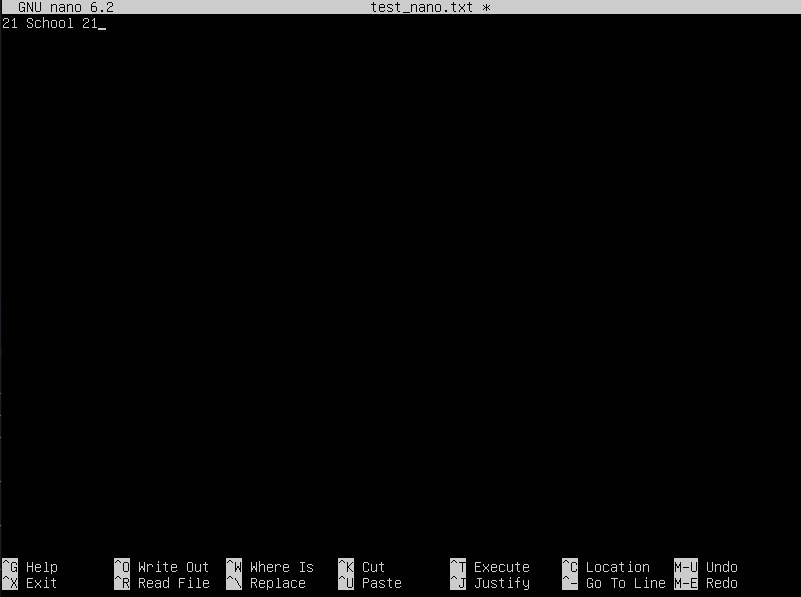
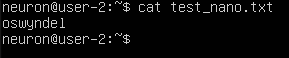

- Поиск: ```Ctrl + W``` 

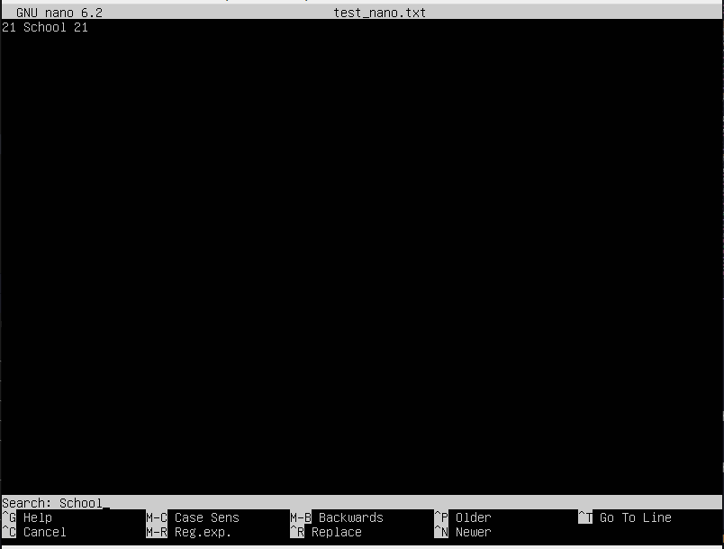

- Замена: ```Ctrl + \```

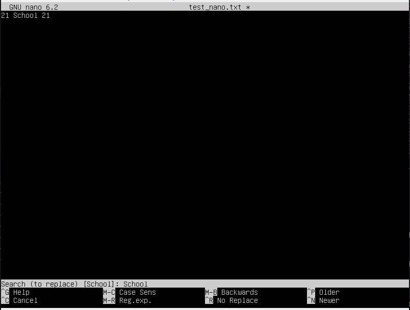
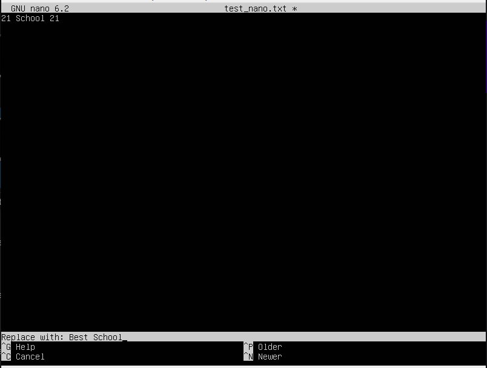
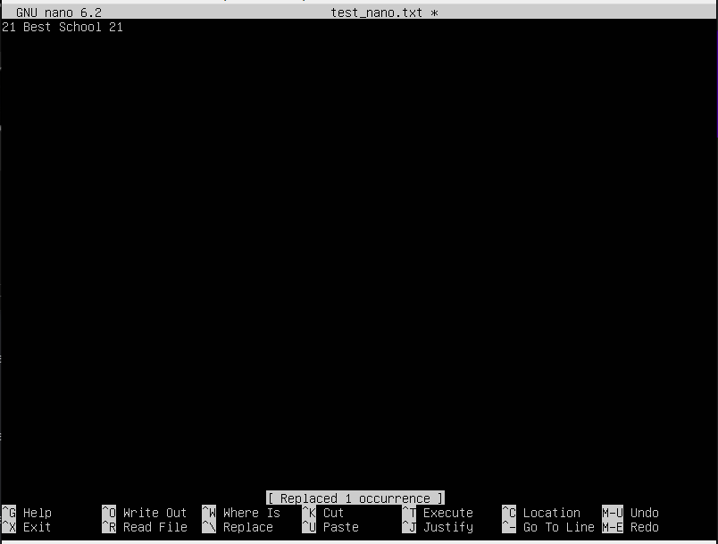


### MCEdit


- Для выхода с сохранением необходимо нажать ```F10``` и выбрать ```yes```:
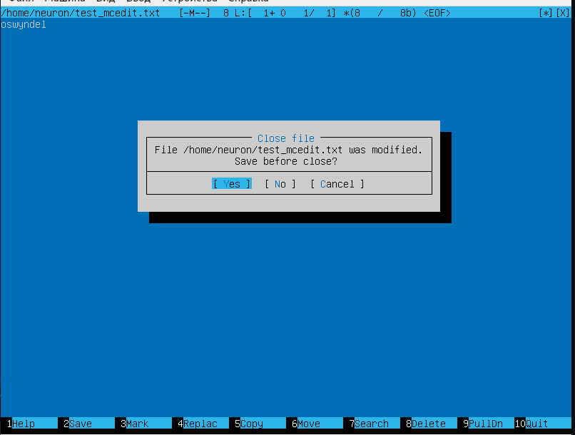


- Для выхода с сохранением необходимо нажать ```F10``` и выбрать ```no```:

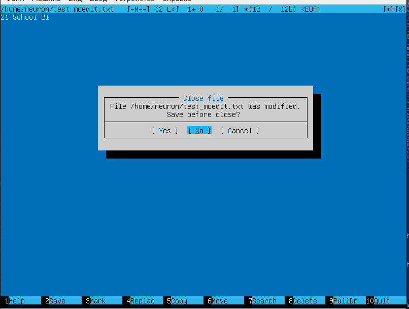
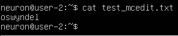


- Поиск: ```F7```; Замена: ```F4```

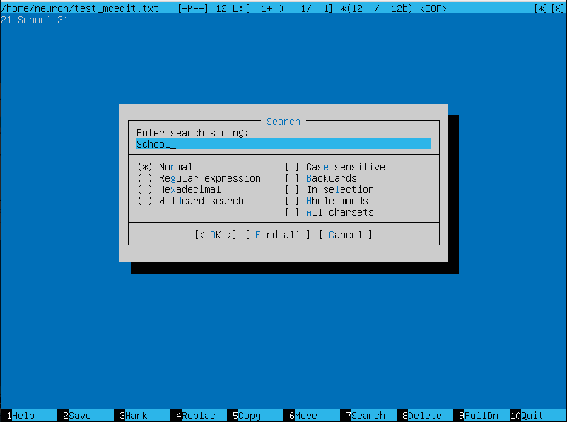
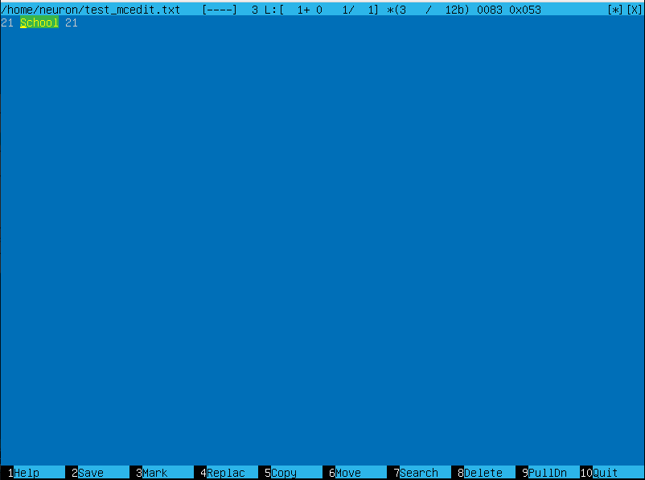

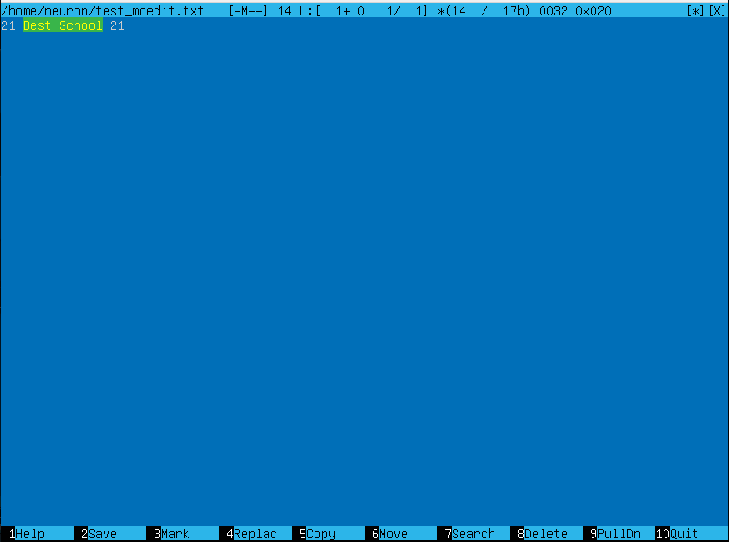


## Part 8. Установка и базовая настройка сервиса SSHD

