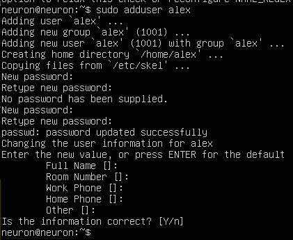

# Отчёт о проделанной работе


## Part 1. Установка ОС

- скриншот вывода ```cat /etc/issue```


## Part 2. Создание пользователя

- скриншот вызова команды для создания пользователя. Для этого используем команду ```sudo adduser <new_user>```.
 После этого добавляем его в группу adm (нахождение в этой группе позволяет читать логи из директории ```/var/log```):
 ```
 sudo usermod -G -a <group> <user>
 ```




P.S.
Полезные флаги для usergmod:

- ```-G``` - дополнительные группы, в которые нужно добавить пользователя
- ```-g``` изменить основную группу для пользователя
- ```-R``` удалить пользователя из группы.
-----

- скриншот вывода ```cat /etc/passwd```


## Part 3. Настройка сети ОС

- задаём название машины вида user-1. Для этого используем команду:
 ```sudo hostnamectl set-hostname <new host_name>```


После перезагрузки изменения вступили в силу.


- в ```systemd``` есть своя утилита для настройки даты и часового пояса - ```timedatectl```. 
Узнать текущий часовой пояс машины можно, выполнив команду ```timedatectl status```:


- для просмотра всех имеющихся часовых зон мы можем выполнить команду ```timedatectl list-timezones```:


- для изменения текущей часовой зоны выполним команду вида ```sudo timedatectl set-timezone <zone>```. После выполнения вновь выведем текущую часовую зону и увидим, что она действительно изменилась:


----

### Справка о сетевых интерфейсах

**Сетевой интерфейс** - это точка взаимодействия между компьютером и сетью. Он представляет собой аппаратное или программное обеспечение, которое позволяет компьютеру подключаться к сети и обмениваться данными с другими устройствами.

Если говорить простыми словами, то сетевой интерфейс - это как дверь, через которую компьютер "выходит" в интернет или другую сеть. Без этой "двери" компьютер не сможет общаться с другими устройствами.

Сетевой интерфейс может быть физическим, например, сетевая карта в компьютере или Wi-Fi адаптер. Он также может быть программным, например, виртуальная сетевая карта в виртуальной машине или программное обеспечение, которое позволяет компьютеру подключаться к сети.


----


- чтобы вывести названия всех сетевых интерфейсов, используем встроенную утилиту ```ip```. Для компактного вывода информации о списке всех сетевых интерфейсов используем команду ```ip -br link show```:


Мы видим, что один из сетевых интерфейсов - lo. Что это?


----
### Справка о lo

**Интерфейс lo (loopback)** - это виртуальный сетевой интерфейс, который присутствует на большинстве операционных систем. Он используется для тестирования сетевых приложений и сервисов, а также для обеспечения доступа к локальной машине из сети.

Если говорить простыми словами, то интерфейс lo - это как зеркало, которое позволяет компьютеру "увидеть" самого себя. Он позволяет отправлять и получать пакеты данных, которые не покидают компьютер.

Например, если вы хотите проверить, работает ли ваш веб-сервер, вы можете отправить запрос на адрес 127.0.0.1 (это стандартный IP-адрес для интерфейса lo), и ваш компьютер ответит на этот запрос.

Также интерфейс lo используется для обеспечения доступа к локальной машине из сети. Например, если вы хотите получить доступ к файлам на вашем компьютере из интернета, вы можете настроить перенаправление портов на интерфейс lo.


----

### Справка о DHCP
**DHCP (Dynamic Host Configuration Protocol)** - это протокол, который позволяет автоматически назначать IP-адреса устройствам в сети. 

Если говорить простыми словами, то DHCP - это как почтальон, который разносит письма (IP-адреса) по домам (компьютерам). 

Когда компьютер подключается к сети, он отправляет запрос на DHCP-сервер, который назначает ему IP-адрес. Этот адрес может быть временным или постоянным, в зависимости от настроек сервера. 

DHCP-сервер также может назначать другие параметры, такие как маска подсети, адрес шлюза и DNS-серверы. Это позволяет компьютерам в сети общаться друг с другом и получать доступ к интернету.

Таким образом, DHCP упрощает процесс настройки сети, так как не нужно вручную назначать IP-адреса каждому устройству.

----


- чтобы узнать ip-адрес устройства, полученный от DHCP-сервера, выполним команду ```cat /var/log/syslog | grep -i 'dhcp'```:


Мы видим, что нашему устройству был присвоен адрес ```10.0.2.15/24```.

Также его можно узнать и чуть проще, выполнив команду ```ip addr show```:


- Для того чтобы узнать внешний IP адрес cвоего устройства, можно открыть специальный сайт, который посмотрит, с какого IP Вы его открыли, и скажет его Вам. Один из таких сайтов - ifconfig.me. Обратимся к нему с помощью ```curl ifconfig.co``` и получим желаемый внешний ip-адрес:


- чтобы узнать внутренний ip-адоес, выполним команду ```hostname -I```:


----

В чём разница между внутренним и внешним ip-адресами?

**Внешний IP-адрес** - это адрес, который присваивается вашему устройству или сети провайдером интернет-услуг. Он позволяет другим устройствам в интернете находить и общаться с вашим устройством.

**Внутренний IP-адрес** - это адрес, который присваивается вашему устройству или сети внутри вашей локальной сети. Он используется только для обмена данными между устройствами в вашей сети.

Если говорить простыми словами, то внешний IP-адрес - это как ваш домашний адрес, который знают все в городе, а внутренний IP-адрес - это как номер вашей квартиры, который знают только ваши соседи.

----


- Попробуем задать статичные настройки ip, gw (gateway), DNS.

Что такое gw в данном контексте?

----
### Справка о Gateway


**Gateway в рамках компьютерных сетей** - это аппаратное или программное обеспечение, которое позволяет сопрягать разные компьютерные сети, использующие разные протоколы. Он конвертирует протоколы одного типа физической среды в протоколы другой физической среды. Например, при подключении компьютера к интернету обычно используется сетевой шлюз. Маршрутизатор (роутер) является одним из примеров аппаратных сетевых шлюзов. Основная задача сетевого шлюза - конвертировать протокол между сетями. Шлюз по умолчанию - это сетевой шлюз, на который пакет отправляется в том случае, если маршрут к сети назначения пакета не известен. Он применяется в сетях с хорошо выраженными центральными маршрутизаторами, в малых сетях, в клиентских сегментах сетей.‍

----


- Протокол DHCP автоматически присваивает устройству IP. Чтобы этого не происходило, необходимо отключить облачную инициализацию. Открываем файл конфигурации ```subiquity-disable-cloudinit-networking.cfg``` в каталоге ```/etc/cloud/cloud.cfg.d/``` и проверим отсутствие конфигурации:

  ```sudo vim /etc/cloud/cloud.cfg.d/subiquity-disable-cloudinit-networking.cfg```


- Перейдём к конфигурации Netplan. **Netplan** - это относительно новая утилита для осуществления настройки сети в Ubuntu. Более подробно о ней можно прочитать [тут](https://habr.com/ru/articles/448400/ "статья на хабре"). В данном случае файл конфигурации - это ```oo-installer-config.yaml```. Откроем его в текстовом редакторе ```vim```:

```sudo vim /etc/netplan/00-installer-config.yaml```


- Пропишем новые настройки для нашего конфигурационного файла:

